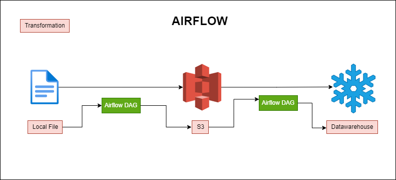
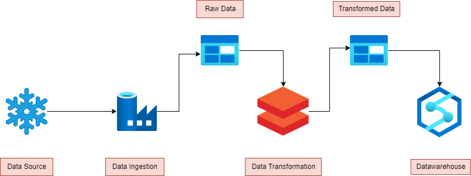

# Markaz APP ETL tasks
The README is describing the steps/approaches taken towards the Data Engineering task

# Task 1 - using Apache Airflow

Below screenshot is the architecture followed in moving the data from csv file all the way to Snowflake

### Tech stack used:
- AWS S3
- Apache Airflow via Astro
- Snowflake Cloud Datawarehouse

### Files in this task

- s3_file_upload - DAG.py -> Airflow DAG that moves data from local storage to aws s3 bucket
- transaction_load - DAG.py -> Airflow DAG that ingests data from s3 bucket, applies transformations on the datasets, and loads the resultant dataset to Snowflake table
- schema.sql -> Complete schema file for snowflake environment

Following steps are included in transaction_load DAG:

- load_file : This loads the file from s3 to dataset in python
- filter_invalid_data : This removes all the rows that have product_id as NULL and also removes complete row duplicates 
- derive_product_category : This generates a product_category column and appends in dataset based on product_id value
- add_tombstone_fields : This adds updated_time value in the dataset which is equal to current_timestamp
- adjust_datetime_fields : This formats the purchase_date column values so it can be casted into date column
- staged_data_task : This moves the data from the datasets into snowflake transactions table. Its a merge step based on customer_id
- product_sales_per_date : This creates a dataset for the products sales for each date
- truncate_reporting_table : This truncates sales_per_product table in snowflake
- sales_per_product_insert : This inserts products_sales_per_date dataset into sales_per_product table in snowflake
- review_ratings : This creates a dataset for total positive and negative review counts for each product_category
- truncate_reporting_table : This truncates review_ratings table in snowflake
- review_ratings_insert : This inserts review_ratings dataset into review_ratings table in snowflake
- avg_ratings_per_product : This creates a dataset for the average ratings for each product date wise. Its a rolling average
- truncate_reporting_table : This truncates rolling_avg_rating_per_product table in snowflake
- rolling_avg_rating_per_product_insert : This inserts avg_ratings_per_product dataset into rolling_avg_rating_per_product table in snowflake
- cleanup : This deletes all the temporary tables created along the way

### Analytics inside Snowflake
Following views are created inside snowflake to further analyse the data:
- satisfactory_score : This creates satisfactory_score of the products, and lists down top 3 products with highest score and with minimum orders placed being 4
- most_popular_categories : This finds top 3 most popular product categories sold
- most_profitable_week : This finds most profitable week in the given dataset

# Task 2 - using cloud platform - Azure

Below screenshot is the architecture followed in moving the data from source database (snowflake in this case) all the data to Azure Synapse Analytics Cloud datawarehouse platform

## Azure services used in this
- Resource Group : For grouping all the services into one group
- Storage Account : For storing of raw and transformed data
- DataFactory : For ingesting data from Snowflake and loading into Storage location
- Databricks : For transforming the data using pyspark
- Synapse Analytics : For storing the data in cloud datawarehouse for business users to query the data from

### Files in this task 
- MarkazApp ETL - Databricks.ipynb
- sql_on_blob_storage.sql

Transformations done in Databricks:
- Filter data for a specific product_id, e.g., product_id 1 with more than 2 order quantity
- Adding PRODUCT_CATEGORY column based on PRODUCT_ID value
- Convert purchase_date to date datatype
- Calculate the total revenue for each product category
- Count the number of purchases for each product category
- Statistics on RATING column
- Calculate the average review ratings for each product

## SQL File has method to connect to your transformed files in blob storage account

# Architecture Explaination

- Data from snowflake is ingested using Datafactory and stored in a raw bucket in storage account
- Using Databricks the raw file is read, transformations are applied using pyspark, datasets are created and all those are written back into transformed bucket on storage account
- Synapse Analytics then reads that data and builds tables and views if need be or query the data using standard SQL
  
